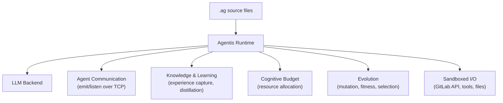

# Agentis

[](https://github.com/Replikanti/agentis/releases/latest)
[](https://github.com/Replikanti/agentis/releases)
[](https://github.com/Replikanti/agentis/releases/latest)

*Digital conditions for emergence.*

Agentis is not an LLM wrapper. It is a runtime, a language, and an evolution engine for autonomous agents that discover each other, form colonies, learn from experience, compete for resources, evolve across generations, and distribute themselves across worker nodes.

Agents written in `.ag` use LLMs to think, but that is where the similarity to prompt orchestrators ends. They have their own compiler, their own content-addressed version control, cryptographic identity, and a resource economy that kills agents who waste it. They run as daemons, survive restarts, and migrate between hosts.

146k lines of Rust. No frameworks, no Tokio, no serde. Everything from the lexer to the P2P wire protocol written from scratch.

## Two Ways to Use Agentis

### I want to run agent colonies

[Agentis Colonies](https://github.com/Replikanti/agentis-colonies) (Apache 2.0) provides pre-built federations of agents that learn by observing how you work. You just need the Agentis binary and a configured LLM backend.

```bash
# 1. Install
curl -fsSL https://github.com/Replikanti/agentis/releases/latest/download/install.sh | sh

# 2. Clone colonies
git clone https://github.com/Replikanti/agentis-colonies.git
cd agentis-colonies/dev-apprenticeship/code-review

# 3. Configure
cp config/colony.example.toml config/colony.toml
# Edit colony.toml: set GitLab URL, token, project, LLM backend

# 4. Start
./scripts/start-colony.sh
```

The runtime launches each agent as a daemon process. Agents discover each other via UDP, communicate over TCP, and share a Cognitive Budget pool. They start by observing your work and gradually gain autonomy as their confidence grows.

### I want to build my own agents

Agentis provides a full language and toolchain for writing agents from scratch. See [Building Agents](#building-agents) below.

## Install

Download the binary for your platform from [Releases](https://github.com/Replikanti/agentis/releases):

| Platform | Binary | Downloads |
|----------|--------|-----------|
| Linux x86_64 | `agentis-linux-x86_64` |  |
| Linux aarch64 | `agentis-linux-aarch64` |  |
| macOS x86_64 | `agentis-macos-x86_64` |  |
| macOS Apple Silicon | `agentis-macos-aarch64` |  |

After downloading, verify the install:

```bash
agentis doctor    # pre-flight check: LLM backend, config, permissions
```

## Configure LLM Backend

Agents need an LLM to think. Configure one in `.agentis/config` (created by `agentis init`):

| Backend | Config | Cost |
|---------|--------|------|
| **Claude CLI** (recommended) | `llm.backend = cli` | Flat-rate subscription |
| **Ollama** (local) | `llm.backend = cli`, `llm.command = ollama` | Free |
| **Anthropic API** | `llm.backend = http` | Per-token |
| **Gemini CLI** | `llm.backend = cli`, `llm.command = gemini` | Flat-rate |
| **Mock** (default) | `llm.backend = mock` | No LLM needed |

## What the Runtime Does

When you run a colony (or any agent), the Agentis runtime provides:



- **LLM calls** — `prompt()` is a language primitive. Typed outputs, validation, confidence scoring.
- **Agent communication** — `emit`/`listen` channels with Ed25519 message signing. Colony-wide broadcast.
- **Cognitive Budget** — every operation costs fuel. Prevents runaway agents. Shared pool within a colony.
- **Learning** — agents capture outcomes, distill knowledge (strategies, heuristics, constraints), and adapt.
- **Evolution** — agents mutate, compete in arenas, and evolve across generations. The good survive.
- **Daemon mode** — tick loops, health checks, watchdog supervisor, graceful shutdown.
- **Sandboxed I/O** — file operations jailed to `.agentis/sandbox/`. Tool calls via MCP/HTTP.

## Building Agents

For those who want to write custom `.ag` agents:

### The Language

In Agentis, **everything is a prompt**. There is no stdlib. If an agent needs to split a string, it asks the LLM.

```
// The LLM is the standard library
let emails = prompt("Extract all email addresses", text) -> list<string>;

// Agents have typed inputs, outputs, and a cognitive budget
agent classifier(text: string) -> Category {
    cb 200;
    let result = prompt("Classify this text", text) -> Category;
    validate result { result.confidence > 0.5 };
    return result;
}

// Pipeline operator — chain agents like Unix pipes
let result = raw_text |> cleaner |> classifier("urgent") |> summarizer;

// Delegate — sub-task assignment with CB caps
let summary = delegate(summarizer, article, 100);

// Agent-to-agent messaging
emit("results", classification);
let msg = listen("results", 5000);

// Evolutionary branching — survive or die
explore "approach-a" {
    let sol = solver(problem);
    validate sol { sol.score > 70 };
}

// Hybrid compute — LLM for reasoning, code for math
let hash = exec python("import hashlib; print(hashlib.sha256(b'hello').hexdigest())");

// Daemon tick loop
fn tick(reason: string) -> void {
    let h = health_check();
    if h.status == "degraded" { emit("alerts", "degraded"); };
}
```

### Key Capabilities

- **Cognitive Budget** — every operation costs fuel. `estimate_cb` predicts cost. Agents decide strategy based on what they can afford.
- **Confidence scoring** — `confidence()` samples the LLM N times and measures agreement.
- **Pipelines & Delegation** — `|>` chains agents. `delegate` assigns sub-tasks with CB caps and contract enforcement.
- **Tool use** — `use_tool` calls external services via MCP, HTTP, or stdio.
- **Semantic guardrails** — `avoid` blocks reject output matching anti-patterns.
- **Suspend/Resume** — agents survive restarts and migrate between nodes.
- **Cryptographic identity** — Ed25519 keypairs. TOFU peer verification. Signed decision chains.
- **Content-addressed VCS** — SHA-256 hashed AST. No merge conflicts. Import by hash.
- **WASM compilation** — full language compiles to portable WASM with CB metering.

### CLI

```bash
# Development
agentis init                          # Create project
agentis go file.ag                    # Commit + run
agentis test <files|dir>              # Run tests
agentis repl                          # Interactive evaluator

# Evolution
agentis mutate file.ag --count 5      # Generate variants
agentis arena dir/ --rounds 3         # Rank by fitness
agentis evolve file.ag -g 20 -n 8    # Full evolution run

# Colony & Daemon
agentis daemon file.ag                # Run as long-lived agent
agentis colony status                 # Colony health
agentis worker [addr:port]            # Start worker node

# Knowledge
agentis knowledge list                # Knowledge base
agentis experience show <agent-id>    # Experience records
```

## Open-Core Model

Agentis follows an open-core model:

- **Agentis runtime** (this repo) — proprietary. The language, compiler, evolution engine, and distributed infrastructure.
- **[Agentis Colonies](https://github.com/Replikanti/agentis-colonies)** — Apache 2.0. Pre-built agent federations that learn your workflow.

## License

Copyright 2026 Replikanti. All rights reserved.
