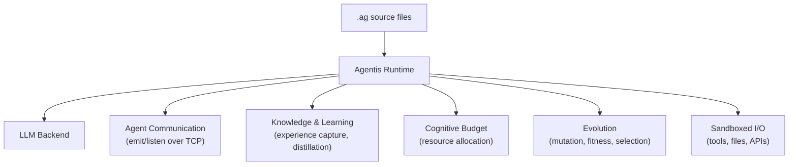

# Agentis

[](https://github.com/Replikanti/agentis/releases/latest)
[](https://github.com/Replikanti/agentis/releases)
[](https://github.com/Replikanti/agentis/releases/latest)

*Digital conditions for emergence.*

Agentis is not an LLM wrapper. It is a runtime, a language, and an evolution engine for autonomous agents that discover each other, form colonies, learn from experience, compete for resources, evolve across generations, and distribute themselves across worker nodes.

Agents written in `.ag` use LLMs to think, but that is where the similarity to prompt orchestrators ends. They have their own compiler, their own content-addressed version control, cryptographic identity, and a resource economy that kills agents who waste it. They run as daemons, survive restarts, and migrate between hosts.

146k lines of Rust. No frameworks, no Tokio, no serde. Everything from the lexer to the P2P wire protocol written from scratch.

## Install

```bash
curl -fsSL https://raw.githubusercontent.com/Replikanti/agentis/main/install.sh | sh
```

Or download the binary for your platform manually from [Releases](https://github.com/Replikanti/agentis/releases).

<details>
<summary>Manual download</summary>

| Platform | Binary | Downloads |
|----------|--------|-----------|
| Linux x86_64 | `agentis-linux-x86_64` |  |
| Linux aarch64 | `agentis-linux-aarch64` |  |
| macOS x86_64 | `agentis-macos-x86_64` |  |
| macOS Apple Silicon | `agentis-macos-aarch64` |  |

```bash
chmod 755 agentis-linux-x86_64
sudo mv agentis-linux-x86_64 /usr/local/bin/agentis
```

</details>

## Quick Start

```bash
agentis init                          # creates .agentis/ config + examples/
agentis doctor                        # verify LLM backend and permissions
agentis go examples/hello.ag          # run your first agent
agentis go examples/classify.ag       # type-safe LLM output with validation
agentis go examples/delegate.ag       # pipelines and delegation (no LLM needed)
```

`agentis init` creates a project with 36 ready-to-run examples covering everything from basic prompts to evolution, colony messaging, and security. A few highlights are included in this repo under [`examples/`](examples/).

<details>
<summary>Configure LLM backend</summary>

Agents need an LLM to think. Configure one in `.agentis/config` (created by `agentis init`):

| Backend | Config | Cost |
|---------|--------|------|
| **Claude CLI** (recommended) | `llm.backend = cli` | Flat-rate subscription |
| **Ollama** (local) | `llm.backend = cli`, `llm.command = ollama` | Free |
| **Anthropic API** | `llm.backend = http` | Per-token |
| **Gemini CLI** | `llm.backend = cli`, `llm.command = gemini` | Flat-rate |
| **Mock** (default) | `llm.backend = mock` | No LLM needed |

Most examples work with the mock backend. No API key needed to get started.

</details>

## Examples

See [`examples/`](examples/) for runnable `.ag` files. Here are a few:

**Type-safe LLM output with validation** ([`classify.ag`](examples/classify.ag)):
```
type Category {
    label: string,
    confidence: float
}

agent classifier(text: string) -> Category {
    cb 200;
    let result = prompt("Classify this text into a category", text) -> Category;
    validate result {
        len(result.label) > 0,
        result.confidence > 0.5,
        result.confidence <= 1.0
    };
    return result;
}

let r = classifier("The stock market crashed today");
print("Label:", r.label, "Confidence:", r.confidence);
```

**Pipeline operator and delegation** ([`delegate.ag`](examples/delegate.ag)):
```
agent doubler(n: int) -> int { return n * 2; }
agent adder(n: int) -> int { return n + 10; }
agent labeler(n: int) -> string { return "result=" + to_string(n); }

// Pipeline: output of one agent becomes input to the next
let piped = 7 |> doubler |> adder |> labeler;
// piped = "result=24"
```

**Evolutionary branching** ([`evolve-seed.ag`](examples/evolve-seed.ag)):
```
// explore forks execution: validation pass -> branch survives, fail -> rolled back
explore "positive-case" {
    let r = analyzer("This product exceeded all my expectations!");
    validate r { r.sentiment == "positive" };
}

// Evolve the agent across generations:
// agentis evolve examples/evolve-seed.ag -g 10 -n 8 --show-lineage
```

**Cognitive Budget** ([`budget.ag`](examples/budget.ag)):
```
cb 120;                                    // total fuel for this program

let a = 2 + 3;                             // costs 1 CB
let d = double(21);                        // costs 5 CB (function call) + 1 CB (arithmetic)
let answer = prompt("What is 6 * 7?", "") -> string;  // costs 50 CB

// Exceed the budget -> CognitiveOverload error. Agents must be efficient.
```

## Run Pre-Built Colonies

[Agentis Colonies](https://github.com/Replikanti/agentis-colonies) (Apache 2.0) provides pre-built federations of agents that learn by observing how you work.

<details>
<summary>Colony quick start</summary>

```bash
git clone https://github.com/Replikanti/agentis-colonies.git
cd agentis-colonies/dev-apprenticeship/code-review

cp config/colony.example.toml config/colony.toml
# Edit colony.toml: set GitLab URL, token, project, LLM backend

./scripts/start-colony.sh
```

The runtime launches each agent as a daemon process. Agents discover each other via UDP, communicate over TCP, and share a Cognitive Budget pool. They start by observing your work and gradually gain autonomy as their confidence grows.

</details>

<details>
<summary>What the runtime does</summary>



- **LLM calls** -- `prompt()` is a language primitive. Typed outputs, validation, confidence scoring.
- **Agent communication** -- `emit`/`listen` channels with Ed25519 message signing. Colony-wide broadcast.
- **Cognitive Budget** -- every operation costs fuel. Prevents runaway agents. Shared pool within a colony.
- **Learning** -- agents capture outcomes, distill knowledge (strategies, heuristics, constraints), and adapt.
- **Evolution** -- agents mutate, compete in arenas, and evolve across generations. The good survive.
- **Daemon mode** -- tick loops, health checks, watchdog supervisor, graceful shutdown.
- **Sandboxed I/O** -- file operations jailed to `.agentis/sandbox/`. Tool calls via MCP/HTTP.
- **Cryptographic identity** -- Ed25519 keypairs. TOFU peer verification. Signed decision chains.
- **Content-addressed VCS** -- SHA-256 hashed AST. No merge conflicts. Import by hash.
- **WASM compilation** -- full language compiles to portable WASM with CB metering.

</details>

<details>
<summary>The language</summary>

In Agentis, **the LLM is the standard library**. There is no stdlib. If an agent needs to split a string, it asks the LLM.

```
// Typed prompt output
let emails = prompt("Extract all email addresses", text) -> list<string>;

// Agents with budget, validation, and typed signatures
agent classifier(text: string) -> Category {
    cb 200;
    let result = prompt("Classify this text", text) -> Category;
    validate result { result.confidence > 0.5 };
    return result;
}

// Pipeline operator -- chain agents like Unix pipes
let result = raw_text |> cleaner |> classifier("urgent") |> summarizer;

// Delegate -- sub-task assignment with CB caps
let summary = delegate(summarizer, article, 100);

// Agent-to-agent messaging
emit("results", classification);
let msg = listen("results", 5000);

// Evolutionary branching -- survive or die
explore "approach-a" {
    let sol = solver(problem);
    validate sol { sol.score > 70 };
}

// Hybrid compute -- LLM for reasoning, code for math
let hash = exec python("import hashlib; print(hashlib.sha256(b'hello').hexdigest())");

// Daemon tick loop
fn tick(reason: string) -> void {
    let h = health_check();
    if h.status == "degraded" { emit("alerts", "degraded"); };
}
```

</details>

<details>
<summary>CLI reference</summary>

```bash
# Getting started
agentis init                          # create project (config + 36 examples)
agentis doctor                        # self-diagnostics
agentis doctor --fips                 # FIPS Known Answer Tests

# Run agents
agentis go file.ag                    # commit + run
agentis test <files|dir>              # run tests (explore blocks as assertions)
agentis repl                          # interactive evaluator

# Evolution
agentis mutate file.ag --count 5      # generate variants
agentis arena dir/ --rounds 3         # rank by fitness
agentis evolve file.ag -g 20 -n 8    # full evolution run

# Colony and daemon
agentis daemon file.ag                # run as long-lived agent
agentis daemon file.ag --colony dev   # run within a named colony
agentis colony status                 # colony health
agentis worker [addr:port]            # start worker node

# Knowledge
agentis knowledge list                # knowledge base entries
agentis knowledge export              # export as JSON
agentis knowledge import f.json       # import entries
agentis experience show <agent-id>    # experience records

# Compilation
agentis compile <branch>              # compile to WASM
agentis wasm-run file.wasm            # run compiled WASM

# Self-update
agentis update                        # update to latest release
agentis update --verify-sig           # verify Ed25519 signature
```

Most commands support `--json` for machine-readable output.

</details>

## Documentation

Full documentation is available at [`docs/`](https://github.com/Replikanti/agentis-core/tree/main/docs) in the core repository (requires access). Topics include deployment profiles, configuration reference, the wire protocol, and the evolution engine.

## Open-Core Model

- **Agentis runtime** (this repo) -- proprietary. The language, compiler, evolution engine, and distributed infrastructure.
- **[Agentis Colonies](https://github.com/Replikanti/agentis-colonies)** -- Apache 2.0. Pre-built agent federations that learn your workflow.

## License

Copyright 2026 Replikanti. All rights reserved.
